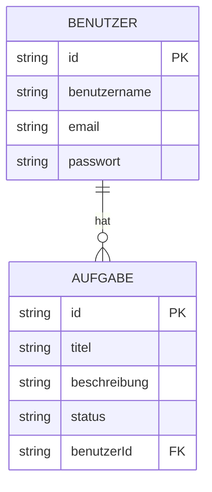

# Aufgaben-Verwaltungs-API (REST API)

Eine sichere RESTful API zur Verwaltung von Benutzern und deren Aufgaben, entwickelt mit Node.js, Express, Prisma und SQLite.

## Features & Sicherheit

- **Beziehungsmodellierung:** 1:N Beziehung zwischen `Benutzer` (User) und `Aufgabe` (Task).
- **Passwort-Sicherheit:** Passwort-Hashing mit `bcryptjs`.
- **Authentifizierung:** JWT (JSON Web Tokens) für geschützte Routen.
- **Header-Schutz:** Sicherheits-Header mit `helmet` und CORS-Aktivierung.
- **ORM:** Sichere Datenbankabfragen mit Prisma gegen SQL-Injection.

## ERD-Diagramm (Entity-Relationship-Diagramm)



## API-Endpunkte

### Benutzer (Users)

| Methode | Endpunkt                     | Beschreibung                             | Authentifizierung |
| ------- | ---------------------------- | ---------------------------------------- | ----------------- |
| `POST`  | `/api/benutzer/registrieren` | Registriert einen neuen Benutzer         | Nein              |
| `POST`  | `/api/benutzer/login`        | Meldet Benutzer an und liefert JWT-Token | Nein              |

### Aufgaben (Tasks)

| Methode | Endpunkt        | Beschreibung                        | Authentifizierung |
| ------- | --------------- | ----------------------------------- | ----------------- |
| `POST`  | `/api/aufgaben` | Erstellt eine neue Aufgabe          | Ja (JWT Bearer)   |
| `GET`   | `/api/aufgaben` | Ruft alle Aufgaben des Benutzers ab | Ja (JWT Bearer)   |

## Installation und Start

1. Repository klonen
2. Abhängigkeiten installieren:
   ```bash
   npm install
   ```
3. Datenbank-Migration ausführen:
   ```bash
   npx prisma migrate dev
   ```
4. Server starten:
   ```bash
   npm run dev
   ```
